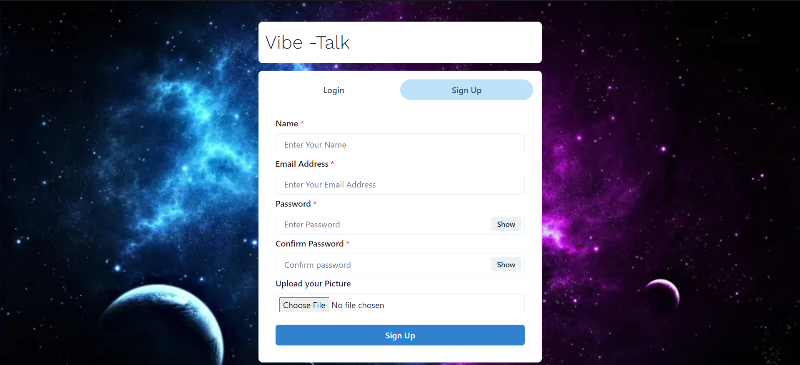
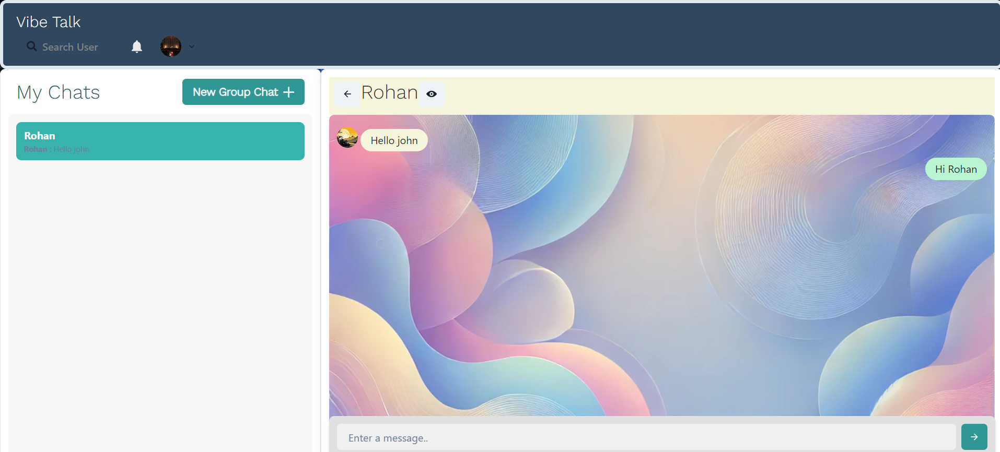

# Vibe Talk

**Vibe Talk** is a feature-rich, real-time messaging platform designed to provide seamless and dynamic communication experiences. Built using the MERN (MongoDB, Express.js, React.js, Node.js) stack, **Vibe Talk** integrates modern web technologies to offer real-time chat functionality with plans for interactive, vibe-based visual enhancements.


- **Project Name**: Vibe Talk
- **Candidate Name**: Rohan Gupta
- **University**: Indian Institute of Technology Jodhpur
- **Department**: Metallurgical and Materials Engineering
- **Application Purpose**: This project was developed to showcase my abilities in building a scalable, real-time web application, and to illustrate my understanding of modern web technologies and software design principles.

## Table of Contents
- [Features](#features)
- [Technology Stack](#technology-stack)
- [Installation](#installation)
- [Configuration](#configuration)
- [API Documentation](#api-documentation)
- [Security](#security)
- [Future Improvements](#future-improvements)
- [Contributing](#contributing)
- [License](#license)
- [Contact](#contact)

## Features

- **Real-time Messaging**: Instant, bi-directional communication via WebSockets.
- **User Authentication**: Secure login and registration using JSON Web Tokens (JWT).
- **Message History**: Persistent storage of conversations with MongoDB.
- **Responsive UI**: Fully responsive chat interface optimized for both desktop and mobile devices.
- **WebSocket-based Communication**: Built using Socket.io for reliable real-time updates.
- **Scalable Design**: Optimized for high-traffic environments with optional Redis session management for WebSocket scaling.

## Preview

Here are some preview images of the Vibe Talk application:

Login Page : -


Registration Page


Chat Page


Group Chat Availability


## Technology Stack

### Front-End
- **React.js**: Modular component-based architecture for building the user interface.
- **Chakra UI**: Customizable component library for responsive and accessible UI design.
- **Socket.io-client**: Real-time WebSocket communication between client and server.

### Back-End
- **Node.js**: Scalable server-side JavaScript runtime.
- **Express.js**: Fast and lightweight web framework for handling API requests and routing.
- **Socket.io**: Real-time, bidirectional event-based communication between server and clients.
- **Mongoose**: Elegant MongoDB object modeling for Node.js.

### Database
- **MongoDB**: NoSQL database for handling persistent data storage, including user profiles and chat history.

### Security
- **JWT (JSON Web Tokens)**: Secure token-based authentication for user sessions.
- **Bcrypt.js**: Password hashing for secure credential storage.


## Installation

### Prerequisites
- [Node.js](https://nodejs.org/en/) (v14 or higher)
- [MongoDB](https://www.mongodb.com/) (Local or Atlas cloud instance)

### Installation Steps

1. **Clone the Repository**
   ```bash
   git clone https://github.com/rohan3433/IBY-Project.git

2. **Install Dependencies**
   ```bash
   npm install

3. **Environment Setup Create a .env file in the root directory with the following configuration:**
   ```bash
   MONGO_URI=your_mongo_connection_string
   JWT_SECRET=your_jwt_secret

4. **Start the Server**
   ```bash
   npm start

5. **Access the Application Open your browser and go to:**
   ```bash
   http://localhost:3000

## Database Setup
The app uses MongoDB as the database. If you’re using MongoDB Atlas, make sure to include the proper connection string in the `MONGO_URI` environment variable. Locally, MongoDB should be installed and running on your machine.

## API Documentation
The backend provides several RESTful API endpoints for user authentication and message handling:

### Authentication
- **POST /api/auth/register**  
  Registers a new user with email and password.

- **POST /api/auth/login**  
  Authenticates a user and returns a JWT for session management.

### Messaging
- **GET /api/messages**  
  Retrieves the chat history for authenticated users.

- **POST /api/messages**  
  Sends a new message to the chat room.

### WebSocket Events
- **Message Event**  
  Sends and receives real-time messages between users.

## Security
**Vibe Talk** prioritizes security with the following measures:

- **Password Hashing**: All passwords are securely hashed using bcrypt before storage.
- **JWT Authentication**: User sessions are managed using signed JWT tokens to ensure secure and stateless authentication.
- **HTTPS**: (Recommended) Ensure secure HTTP communication by deploying the app with SSL/TLS certificates in production.

## Future Improvements
**Vibe Talk** aims to continually evolve with exciting new features. Some planned improvements include:

1. **Dynamic Chat Backgrounds**: Chat background colors will change based on the tone or "vibe" of the conversation, providing a more immersive and interactive experience. This aligns with the app's name, **Vibe Talk**, where the visual style enhances the emotional tone of the conversation.
2. **End-to-End Encryption**: Enhance user privacy and data security by implementing full end-to-end encryption for messages.
3. **Multimedia Messaging**: Add support for sharing images, videos, and voice messages during chats.


## License
This project is licensed under the MIT License. See the [LICENSE](LICENSE) file for more details.

## Contact
For any questions, feedback, or support, please contact:

- **Email**: rohanab343@gmail.com


